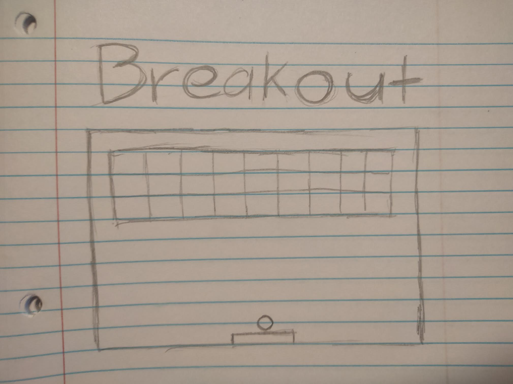

# BreakOut
This game is a top-down 2d breakout game. The game will start right when the game loads. If the ball collide with the     bricks the bricks will dissapear. The game will end if you break all the bricks or if you lose all you lives. 

# Wireframes
  
   

# Tech Being Used
  Javascript
  HTML
  CSS

# MVP Checklist
  - Create a canvas to draw on it 
  - Move the paddle
  - Move the ball
  - Control paddle with keyboard controls
  - Build the bricks 
  - Collision detection
  - Gameover
  - Style Game

# Stretch Goals
  - Use mouse to control
  - Track score
  - Style game even more
  - Add music 

# Issues And Bugs

